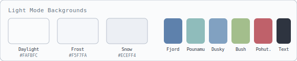
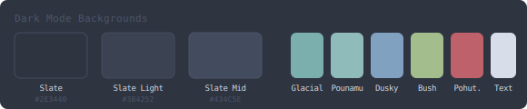

# Kiaora Theme for OpenCode

A custom [OpenCode](https://opencode.ai) theme inspired by the landscapes of Aotearoa New Zealand -- glacial lakes, pounamu jade, dusky fjords, native bush, and overcast southern skies.

---

## Light Mode

Near-white backgrounds with subtle cool-grey depth. Dark slate text for crisp readability.



| Swatch | Role | Name | Hex |
|--------|------|------|-----|
|  | Background | Daylight | `#FAFBFC` |
|  | Panel | Frost | `#F5F7FA` |
|  | Element | Snow | `#ECEFF4` |
|  | Text | Slate | `#2E3440` |
|  | Primary | Fjord | `#5E81AC` |
|  | Accent | Pounamu | `#8FBCBB` |
|  | Secondary | Dusky Blue | `#81A1C1` |

---

## Dark Mode

Deep slate backgrounds with cool elevation. Light cloud text for comfortable reading.



| Swatch | Role | Name | Hex |
|--------|------|------|-----|
|  | Background | Slate | `#2E3440` |
|  | Panel | Slate Light | `#3B4252` |
|  | Element | Slate Mid | `#434C5E` |
|  | Text | Cloud | `#D8DEE9` |
|  | Primary | Glacial | `#7BAFAE` |
|  | Accent | Pounamu | `#8FBCBB` |
|  | Secondary | Dusky Blue | `#81A1C1` |

---

## Shared Accent Colours

These colours are used in both light and dark modes.

| Swatch | Name | Hex | Usage |
|--------|------|-----|-------|
|  | Pounamu | `#8FBCBB` | Accent, active border |
|  | Glacial | `#7BAFAE` | Primary (dark), variables |
|  | Clear Sky | `#88C0D0` | Info (dark), headings |
|  | Dusky Blue | `#81A1C1` | Secondary, keywords |
|  | Deep Fjord | `#6E8FAD` | Functions (light) |
|  | Fjord | `#5E81AC` | Primary (light), info |
|  | Bush | `#A3BE8C` | Success, strings, diff added |
|  | Pohutukawa | `#BF616A` | Error, diff removed |
|  | Tussock | `#EBCB8B` | Strong text |
|  | Kowhai | `#D08770` | Warning, emphasis |
|  | Manuka | `#B48EAD` | Numbers |

---

## Full Palette

### Light Backgrounds

<p>
  
  
  
  
  
  
  
</p>

### Dark Backgrounds

<p>
  
  
  
  
</p>

### Accents

<p>
  
  
  
  
  
  
  
  
  
  
  
</p>

---

## Installation

### Option 1 -- User-wide (recommended)

Copy the theme file into your OpenCode config directory so it is available in every project.

```bash
# Create the themes directory if it doesn't exist
mkdir -p ~/.config/opencode/themes

# Copy the theme file
cp kiaora.json ~/.config/opencode/themes/kiaora.json
```

### Option 2 -- Per-project

Place the theme file inside your project so it only applies there.

```bash
# From your project root
mkdir -p .opencode/themes

# Copy the theme file
cp /path/to/kiaora.json .opencode/themes/kiaora.json
```

### Activate the theme

**Method A -- Command palette**

1. Open OpenCode
2. Type `/theme`
3. Select `kiaora` from the list

**Method B -- Config file**

Create or edit `tui.json` in your OpenCode config directory (`~/.config/opencode/tui.json` or `<project-root>/.opencode/tui.json`):

```json
{
  "$schema": "https://opencode.ai/tui.json",
  "theme": "kiaora"
}
```

### Switching between light and dark mode

OpenCode auto-detects your terminal's background colour to choose the light or dark variant. If it picks the wrong one (see [known issue](https://github.com/anomalyco/opencode/issues/23810)):

1. Press `Ctrl+P`
2. Select **"Switch to light mode"** (or dark)
3. Select **"Lock theme mode"** to persist across restarts

---

## Requirements

Your terminal must support **truecolor** (24-bit colour) for the palette to render accurately.

```bash
# Check support
echo $COLORTERM
# Should output: truecolor or 24bit

# If not set, add to your shell profile
export COLORTERM=truecolor
```

Compatible terminals: iTerm2, Alacritty, Kitty, Windows Terminal, WezTerm, GNOME Terminal (recent).

---

## Theme Mapping Reference

| Role | Light | Dark |
|------|-------|------|
| **Primary** |  Fjord |  Glacial |
| **Secondary** |  Dusky Blue |  Dusky Blue |
| **Accent** |  Pounamu |  Pounamu |
| **Background** |  Daylight `#FAFBFC` |  Slate `#2E3440` |
| **Panel** |  Frost `#F5F7FA` |  Slate Light `#3B4252` |
| **Element** |  Snow `#ECEFF4` |  Slate Mid `#434C5E` |
| **Text** |  Slate `#2E3440` |  Cloud `#D8DEE9` |
| **Success** |  Bush |  Bush |
| **Error** |  Pohutukawa |  Pohutukawa |
| **Warning** |  Kowhai |  Kowhai |
| **Info** |  Fjord |  Clear Sky |

---

## License

MIT
